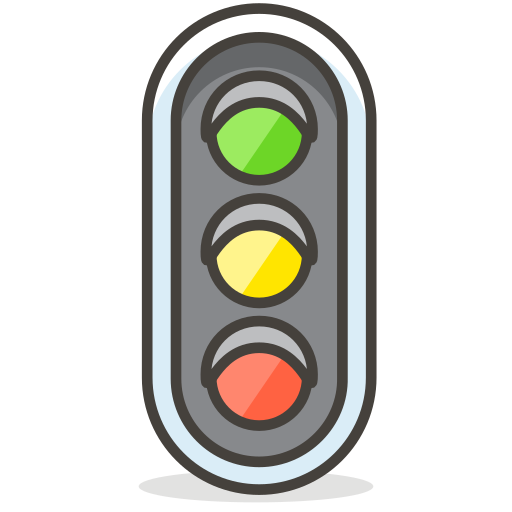
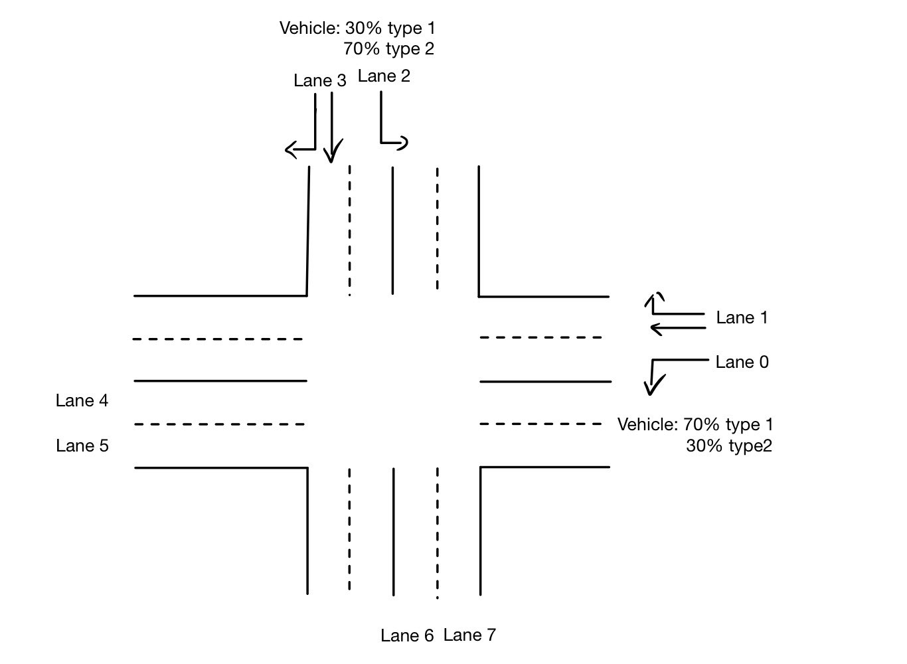
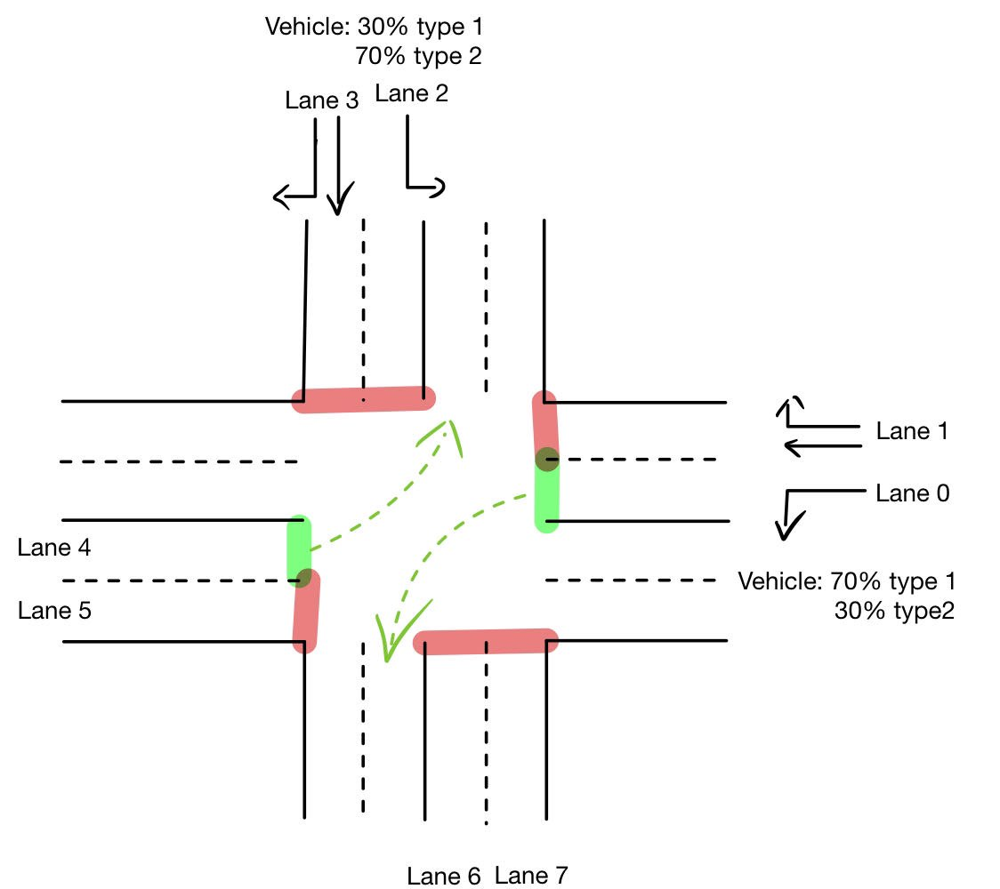
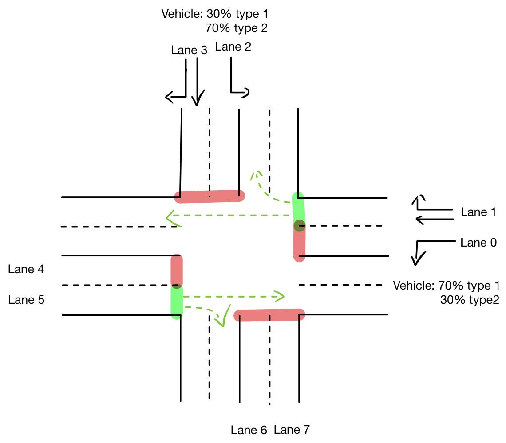
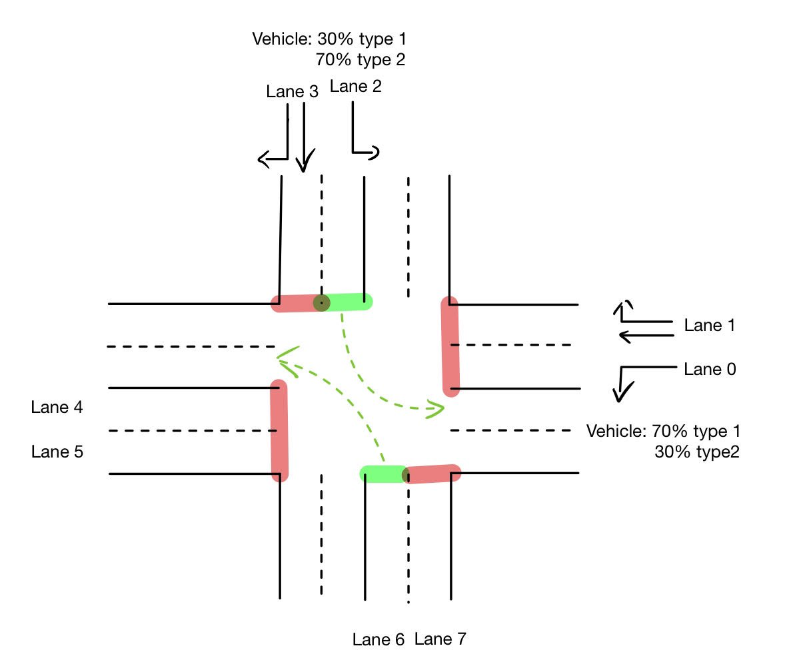
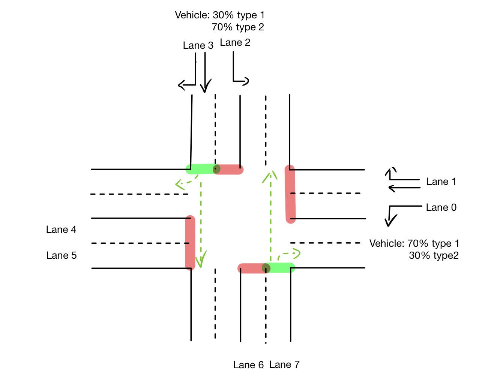

[](https://classroom.github.com/a/SAF4jQrf)
# FinalProject
<!-- For project info and grading see the slides in StudIP. -->

## Track 2: Reinforcement Learning in Traffic Signal Environment
<!-- write a simply summary about the enviroment -->
<!-- Find project information in `track_env`. -->

### A fixed-flow traffic intersection environment

In this environment, a simulation of an intersection under relatively fixed traffic flow conditions is conducted. Within this setting, the number of vehicles generated on the lane at each step and the number of vehicles departing during green light phases are random but within a fixed range, which means the traffic volume does not fluctuate significantly over time.

In the [intersection view](#intersection-view) below, theoretically, the traffic on each lane does not affect each other. With fixed traffic flow, the conditions on the opposite lane can be considered approximately similar. Therefore, only the traffic situation on the roads from north to south and from east to west will be considered for optimization.

### A real-flow traffic intersection environment

In this environment, a simulation of a real traffic flow scenario at a crossroads intersection over a day (86,400 seconds, with one step representing one second) is conducted ([data](/TrafficData)) . The data includes the total hourly traffic volume on one lane for all 24 hours of the day, which allows for the calculation of the probability of a car appearing on the road every second. During green light phases, it is estimated that 0.45 vehicles can leave the lane per second, which means approximately 13 or 14 vehicles can depart in half a minute.

### Intersection view
The intersection consists of four main lanes, each comprising two sub-lanes: one for vehicles turning left and another for vehicles going straight or turning right. Correspondingly, there are four states of traffic lights (see [Action](#action)). Two types of vehicles are set up, each with different CO2 emission parameters.


<!-- the defination of the lane / show image -->

## Installation
```bash
git clone https://github.com/automl-edu/final-project-reward-chasers.git
cd final-project-reward-chasers-main
conda create -n rlenv python=3.11
conda activate rlenv

# Install with requirements.txt
pip install -r requirements.txt

# Or install for usage (this project: don't use)
pip install .

# Or install for development (here: use)
make install-dev
```

## MDP - Observations, Actions and Rewards
### Observation
he default observation for the traffic signal agent is a vector:
```python
obs = [lane_1_queue, ..., lane_n_queue, total_queue, 
       lane_1_watingTime, ..., lane_n_waitingTime, total_waitingTime, 
       lane_1_co2Emission, ..., lane_n_co2Emission, total_co2Emission]

```
`lane_n_queue` and `total_queue` is the number of vehicles in incoming lane n and the sum of the number of vehicles in all lanes
`lane_n_watingTime` and `total_waitingTime` is the sum of waiting time of all vehicles in incoming lane n and the sum of waiting time of all vehicles in all lanes
`lane_n_co2Emission` and `total_co2Emission` is the sum of co2 emission of all vehicles in incoming lane n and the sum of co2 emission of all vehicles in all lanes

### Action
The action space is discrete. Every 'min_time' seconds, each traffic signal agent can choose the next green phase configuration. The green phases are shown below:

<p align="center">
  
  
  
  
</p>
<!-- bild  -->

### Rewards

Three different rewards will be considered: queue length, waiting time and co2 emission.
#### Reward Function of Queue

$$ R_Q = - \left(\sum_{j \in Line}^n (N_{j, t}) \right)^{2} $$

where $N_{j, t}$ is the Number of halting vehicles in the lane $j$ at time point $t$. Another queue length reward equation involves the difference in the number of vehicles across all lanes between time $t$ and the previous time point $t-1$.

$$ R_Q = \sum_{j \in Line}^n (N_{j, t-1}) - \sum_{j \in Line}^n (N_{j, t}) $$
#### Reward Function of Waiting Time

Reward function 1 of waiting Time:

$$R_T = 0.01 \cdot \left(\sum_{j \in Line}^n (T_{j, t-1}) - \sum_{j \in Line}^n (T_{j, t}) \right)$$

where $T_{j, t}$ is the  Waiting Time of all halting vehicles in the lane $j$ at time point $t$.

Reward function 2 of waiting Time:

$$ R_T = 0.01 \cdot \sum_{j \in Line}^{n} \left( \frac{1}{T_{wait}} \right) $$

Reward function 3 of waiting Time:

$$ R_T =  -0.01 \cdot \sum_{j \in Line}^{n} \left( T_{wait} \right) $$

#### Reward Function of co2 emission

$$ R_C = 0.01 \cdot \left(\sum_{j \in Line}^n (C_{j, t-1}) - \sum_{j \in Line}^n (C_{j, t}) \right) $$

where $C_{j, t}$ is the Co2 emission of all halting vehicles in the lane at time point $t$.

## Evaluation

### in fixed-flow traffic intersection environment

We compare the results after optimization with those produced by the fixed traffic light cycle (as a baseline).

Since the traffic flow is fixed, a fixed traffic light cycle is already a relatively optimal choice (Assuming a completely fixed traffic flow scenario, such as one car entering each lane every 5 seconds, then a fixed traffic light program would be the optimal solution, Because of the uncertain traffic flow conditions, fixed traffic light cycle cannot tackle these issues effectively, as they allocate the same green light duration to both less busy lanes and more congested lanes, in this environment, we introduce randomness to the number of vehicles added to each lane). From the diagrams (Queue), it can be observed that, after optimization with PPO and A2C algorithms, the optimized traffic light strategy can reduce the number of cars by 4 to 5 per lane compared to a fixed traffic light cycle. 

After optimization with PPO and A2C, the waiting time and the co2 emission are both better than that of a fixed traffic light cycle. The optimization results of the two algorithms are very close.

(all results with seed = 42)

#### PPO:
Queue:
<p align="center">
  
  
</p>

Waiting Time: 

<p align="center">
  
  
</p>

Co2 Emission

<p align="center">
  
  
</p>

#### A2C:

Queue:

<p align="center">
  
</p>

Waiting Time: 
<p align="center">
  
  
</p>

Co2 Emission

<p align="center">
  
  
</p>


### in real-flow traffic intersection environment
After simulating real traffic flow (you can find data [here](/TrafficData)), we can see in the diagram that, apart from the afternoon hours, the traffic volume is lower at other times of the day. During the afternoon to evening rush hour, traffic volume surges, making it prone to traffic jam.

After five episodes of optimization (only Queue) with the PPO algorithm, during high traffic volume time, the number of waiting vehicles has significantly decreased.

<p align="center">
  
</p>

All outputs are located in [outputs](/outputs).

<!-- - Use different seeds for training
- Plot training performance 
- Agent and Env Track: Compare final performance across baselines, use rliable -> plot
- Env Track: Compare performance on different env variations, if applicable, use rliable -> plot -->


<!-- 
## Tasks and Tips
- Put your source code (agent / env) into the src folder. Put your training scripts in a separate folder on the same level, e.g., into `experiments` or `training`.
- You can delete files from this repo (e.g. `src/myfile.py`) if not needed.
- For building docs use the command `make docs` (other, more detailed commands are available in the make file).
- For formatting everything use `make format` (⚠ PLEASE FORMAT) (⚠ You need to add your experiment dir in the makefile).
- If you are really really stuck you can use the feedback pull request feature.
- Update this README with a nice overview and a minimal example of your project (see [our SMAC README](https://github.com/automl/SMAC3) for a nice example). The README basically is your advertisement/awesome summary of your repo.
- Keep this as your directory and run stuff from here, e.g., `python track_agent/example.py` (this requires the requirements from the folder and downloads the env, so beware:). Sometimes you need to adjust your path variables by inserting the root repo at the beginning of the code:
  - ```python
    import os
    import sys
    sys.path.append(os.path.abspath(os.path.join(os.path.dirname(__file__), "..")))
    ```
- Add your requirements to `setup.py`-> `extras_require`.
- Please add your proposal as `PROPOSAL.md`.
- You can check out [`rliable`](https://github.com/google-research/rliable) to see how you could report results. Also, sometimes it makes sense to report the interquartile mean (IQM) instead of the mean. 
- When you evaluate your agent, use n evaluation episodes (e.g. 5-10) to factor out env stochasticity.
 -->


## Minimal Example

<!-- add discription how to change rewardfunction -->

#### ppo in real flow traffic intersection environment
train the real flow traffic intersection environment with PPO for 5 episodes, using [second queue reward function](#rewards).
```bash
python3 src\RealTrafficEnv_ppo_training.py
```
#### a2c in fixed-flow traffic intersection environment
train the fixed flow traffic intersection environment with A2C for 50000 steps, using [second queue reward function](#rewards).
```bash
python3 src\TrafficEnv_a2c_training.py
```

#### ppo in fixed-flow traffic intersection environment 
train the fixed flow traffic intersection environment with PPO for 50000 steps, using [second queue reward function](#rewards).
```bash
python3 src\TrafficEnv_ppo_training.py
```

